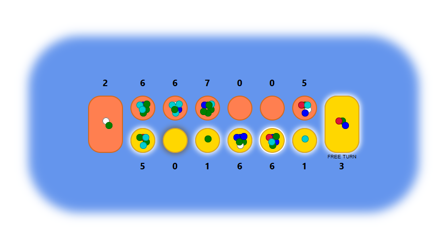

# Kalah
Kalah is a two-player turn-based strategy board game in the mancala family. It has been made playable on the web browser with the power of `express` and `socket.io`.

# How to play
Both players have 6 small vessels called bins and 1 large vessel called a store. At the beginning of the game all bins are filled with 4 stones each. The south player starts first.

On a player's turn they select a non-empty vessel on their side. All stones are removed from that vessel and are added one-by-one into vessels counter-clockwise starting from the next vessel, but always skipping the opponent's store, until all stones are deposited.

If the last stone is placed into the player's own store, the player gets another turn. If the last stone is placed into the player's own empty bin, that stone and all stones in the adjacent opponent's bin are moved into the player's store - this is called a capture.

The game ends when all bins on any side are empty. The player with more stones in all their vessels wins.

# How to run
Run `yarn run build` or `yarn run watch`.
Run `yarn run start`.
